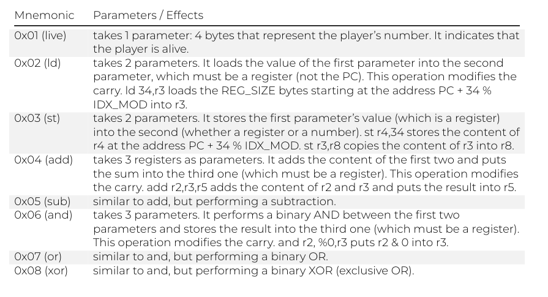
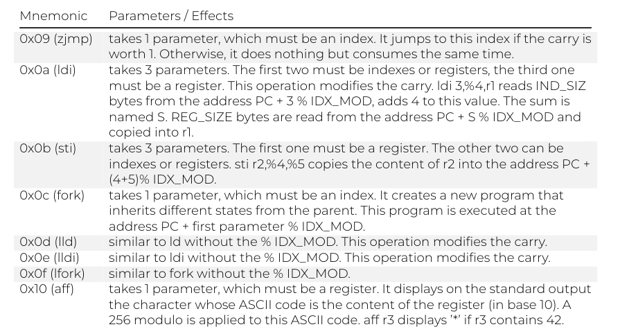
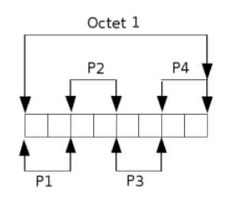
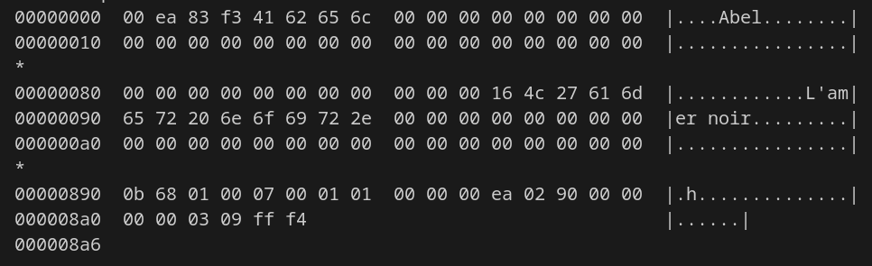
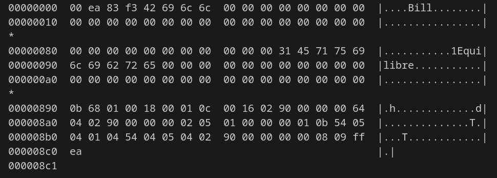
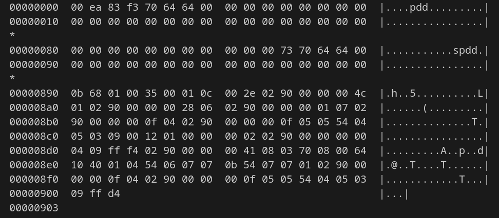
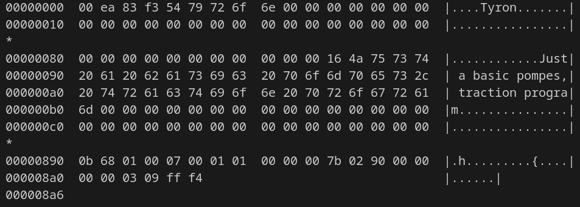

# Robot Factory
###### Module: Elementary Programming B2

## Objectives:

Transcript the files written into bytecode into a file.cor

#### Champion description structure:
* **magic:** code of the header.
* **.name:** name of the warrior.
* **.comment:** warrior's phrase.
* **prog_size:** the size of the assembly code.

#### Parameters:
- **Types:**
  - Register: used to store integers, show as **'r(int)'**
  - Direct: represents the direct value, show as **'%(int)'** or **'%:(label)'**.
  - Indirect: represents the value that is found in certain position in the address, show as **'(int)'**.

- **All parameters:**




- **Coding Byte:**
The coding byte is a value that describes the type of parameter that are given.

  A byte that is divided in pairs of bits that represents Param1, Param2, Param3 & Param4.
  **Pairs of bits:** register -> **01**, direct -> **10**,  indirect -> **11**, otherwise -> **00**


  Example: r2, 2, %34 -> coding byte is **01 11 10 00**

- **Transcription:**
  - Instruction code (**mnemonic**): example -> live = **0x01**
  - Coding byte: value to describe the parameters
  - Parameters values: examples (bold characters) -> r**1**, %**45**, **45**.

## Compilation:
```
make re
```

## Usage:
Execute the following command:
```
./asm [path_file]
```
* **path_file:** the path to the file you want to 

###### This will create a file with the commands in binary (file.cor), execute the following command in order to see the bytecode.

```
hexdump -C file.cor
```
**Results** of the files in the champions folder:

* Abel:

* Bill:

* Pdd:

* Tyron:

